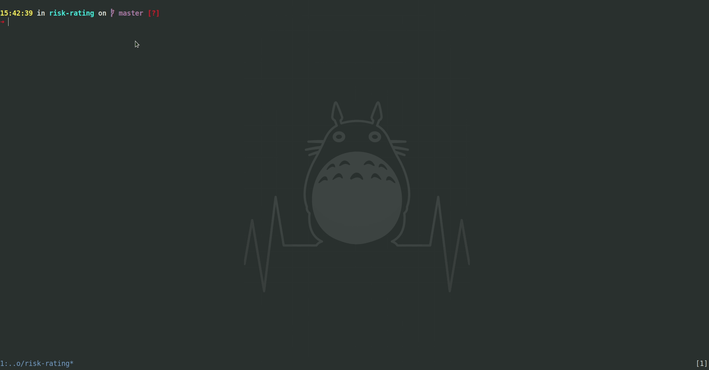

# OWASP risk rating Asciidoctor table generator



- [OWASP risk rating Methodology](https://www.owasp.org/index.php/OWASP_Risk_Rating_Methodology)
- [Asciidoctor](https://asciidoctor.org/)

```bash
# Generate Asciidoctor risk rating table

# With go
go run main.go new
# With the binary
./bin/risk-rating new
# With docker
docker run -it --rm risk-rating new
```

